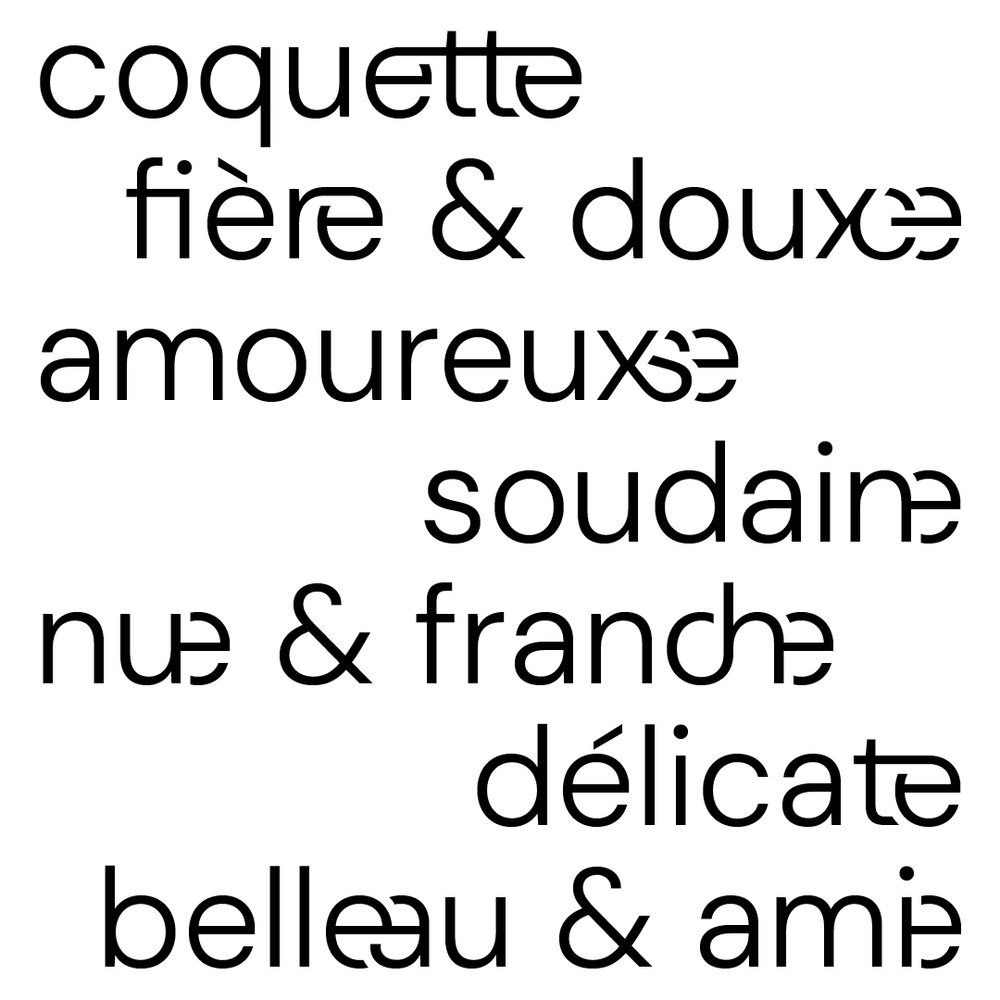

# BBB DM Sans

La BBB DM Sans est un fork post-binaire de la [DM Sans](https://fonts.google.com/specimen/DM+Sans) de Colophon Foundry. Les caractères post-binaires bas de casse ont été dessinés par Camille Circlude, Eugénie Bidaut et Mariel Nils en 2023 pour la communication du [Théâtre Varia](https://varia.be) à Bruxelles. En 2025, Bérénice Bouin dessine les capitales post-binaires en vue de la publication des fontes sur la [Typothèque Bye Bye Binary](https://typotheque.byebyebinary.space).

Les fontes sont distribuées sous licence [SIL OFL](https://openfontlicense.org/open-font-license-official-text).